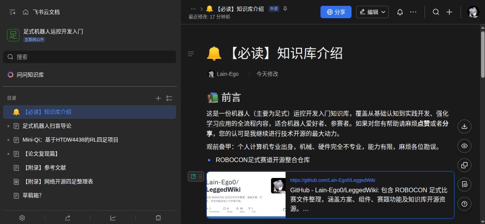

# 🦿 LocoWiki Legged Robot Motion Control Wiki Repository

Project website: https://locowiki.github.io/

> [中文](README.md) | English

LocoWiki, formerly known as ROBOCON_Legged_Robot, is a one-stop resource repository built for robot motion control learning. It serves competition preparation, research study, and development lookup scenarios, and covers core full-pipeline resources for legged robot development:

- 📋 Official rule documents from past competitions
- 📢 Technical sharing from university competition teams
- 📄 Paper study list (reading list + recommended paper PDFs)
- 🔗 Curated mainstream open-source projects, core components, and learning knowledge bases

**Supporting System Tutorial**: [Knowledge Base for Robot Motion Control Development](<https://wcn9j5638vrr.feishu.cn/wiki/space/7570988375279517715?ccm_open_type=lark_wiki_spaceLink&open_tab_from=wiki_home>)

> This repository owns robotics knowledge content. Website code, interface copy, and site-maintenance documents belong in [LocoWiki.github.io](https://github.com/LocoWiki/LocoWiki.github.io). See [Content Structure and Website Boundary](CONTENT_STRUCTURE.en.md) for the directory-to-collection rules.

  

---

### 🚀 Quick Navigation
| Module | Direct Entry |
| :--- | :--- |
| Competition Rules | [Competition Rules](competition-rules/README.en.md) |
| Network Open Source | [Network Open Source](network-open-source/README.en.md) |
| Technical Sharing | [Technical Sharing](technical-sharing/README.en.md) |
| Paper Study List | [Reading list (paper index and original links)](reading-list/README.en.md) |
| Supporting Tool Scripts | [scripts](scripts/README.en.md) |

---

> Complete competition solutions, core drivers, competition resources, and learning knowledge bases are maintained in [Network Open Source](network-open-source/README.en.md).

---

## 🤝 Contribution Guidelines
We welcome developers and competition teams to improve this repository together. Contribution methods are:
1. **Add New Materials**: Place files by content type in `competition-rules/` and `technical-sharing/`. For papers, maintain metadata and original-source links in `reading-list/papers.json` or `reading-list/README.en.md`.
2. **Add New External Links**: Prioritize official or original-author open-source repository links. Clearly label the project purpose and institution affiliation to keep information traceable.
3. **Update the Paper List**: Maintain paper entries in `reading-list/papers.json`, then run `python3 scripts/resolve_paper_links.py --update-index` to resolve original-source links.
4. **Large File Handling**: For single files larger than ~100MB, use Git LFS, or replace them with compliant external links.

---

## ⚠️ Disclaimer
1. This repository is for non-commercial learning exchange and resource indexing only. Copyright and attribution rights for all materials belong to the original authors and publishers.
2. If any content in this repository involves infringement, improper disclosure, or other issues, please contact the repository maintainers via Issues or direct message. We will verify and handle it as soon as possible.
